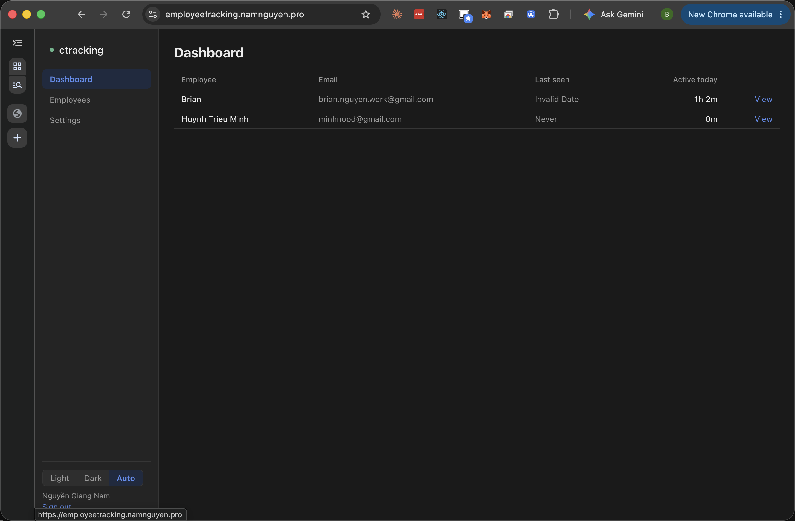
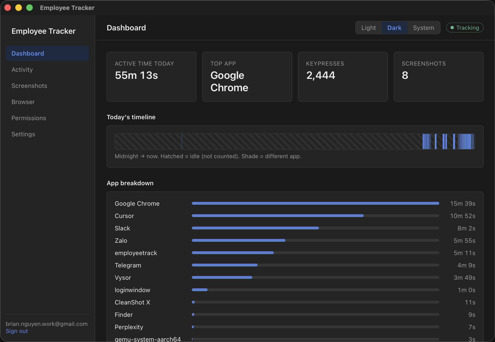
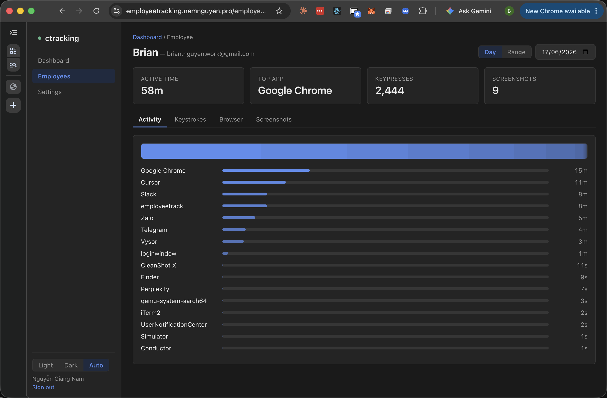

<div align="center">


# BiBoTracking

**The free, open-source, self-hostable [Hubstaff](https://hubstaff.com) alternative.**

Local-first time & activity tracking for teams and families. A desktop app captures
activity on each machine and (optionally) syncs to a backend you control; owners review
everything in a clean web dashboard.

[Website](https://bibotracker.com) ·
[Download for macOS](https://bibotracker.com/download/EmployeeTracker-macOS.dmg) ·
[Chrome extension](https://chromewebstore.google.com/detail/employee-tracker/meoifmgllkafmaeckbdambfnoolnilme) ·
[vs Hubstaff](https://bibotracker.com/#compare) ·
[Telegram support](https://t.me/bibotracker)




</div>

---

## Why BiBoTracking

Most employee-tracking tools are expensive per-seat SaaS that ship your team's activity to
someone else's cloud. BiBoTracking flips that:

- 💸 **Free & open source** — read, audit and run the whole stack yourself. No per-seat pricing.
- 🔒 **Local-first & private** — activity is stored **on each device**, and only rolled up to a
  backend you choose. The Chrome extension reports to `127.0.0.1` and **never** to the cloud.
- 🏠 **Self-hostable** — one Go binary serves the API *and* the dashboard, backed by Postgres.
  Your infrastructure, your rules, no lock-in.
- 👀 **No black box** — see exactly what is captured, and what never leaves the machine.
- 👨‍👩‍👧 **Teams *or* families** — pick a `team` or `family` workspace; vocabulary adapts
  (employee/kid, owner/parent).
- 🌍 **7 languages** — English, 简体中文, 日本語, Tiếng Việt, Bahasa Indonesia, Français, Español.

> **Hosted option:** prefer not to run servers? The hosted service at
> [bibotracker.com](https://bibotracker.com) is free for your first two years, then $1/month.
> Self-hosting is free, forever.

## What it captures

- Active **app & window** time
- **Keystroke volume** (counts, not keylogging)
- Periodic **screenshots** (configurable / can be disabled)
- **Browser activity** via the Chrome extension (local-only)

Capture is governed by a per-workspace policy — owners decide what's on.

## Screenshots

| Owner dashboard | Desktop tracker | Per-member activity |
| --- | --- | --- |
|  |  |  |

## Architecture

A pnpm + Go monorepo. One backend binary serves the API and all static content (dashboard +
marketing) from the same origin.

```
apps/
  backend     Go API + static file server — Gin + pgx (no CGO) + Postgres
  web-admin   React 19 + Vite owner dashboard (served at /admin)
  desktop     Tauri 2 (Rust) + React tracker app — macOS + Windows
  extension   Chrome MV3 extension — reports browser activity to 127.0.0.1
packages/     shared workspace packages
marketing/    static landing site (generated, i18n)
```

**Data model:** `users` (login by email **or** username), `businesses` (`team` | `family`),
`memberships` (`owner` | `employee`), `devices`, plus activity / screenshot / browser tables.
Migrations are embedded and run automatically on startup (goose).

## Quick start (local dev)

**Prerequisites:** Node ≥ 20, pnpm ≥ 10, Go ≥ 1.22, Docker (for Postgres), and Rust (for the
desktop app).

```bash
git clone https://github.com/ngnclht1102/bibo-emplooyee-tracking.git
cd bibo-emplooyee-tracking
pnpm install

# 1. Postgres in Docker (role/db `ctracking`, :5432)
scripts/dev-db.sh

# 2. Go backend on :8080 (auto-copies .env, runs migrations)
scripts/dev-backend.sh

# 3. Web dashboard on http://localhost:5174/admin/
scripts/dev-web.sh

# 4. (optional) Desktop tracker
scripts/dev-desktop.sh
```

Open **http://localhost:5174/admin/**, register an owner account, and you're running.

> The backend has no hot reload — restart `dev-backend.sh` after Go changes.

## Self-hosting

The whole stack ships as **one Go binary + Postgres**, no nginx required.

1. Build the backend for your server: `GOOS=linux GOARCH=amd64 go build ./...` (from `apps/backend`).
2. Build the dashboard (`apps/web-admin`, `npm run build`) and marketing site
   (`node marketing/build.mjs`) — the binary serves both as static files.
3. Point it at a Postgres database (migrations run on startup) and run it behind TLS
   (a reverse proxy or a [Cloudflare Tunnel](https://developers.cloudflare.com/cloudflare-one/connections/connect-networks/) both work).

A step-by-step production guide lives in [`docs/`](docs/).

## Tech stack

| Layer | Tech |
| --- | --- |
| Backend | Go, Gin, pgx (no CGO), Postgres, goose migrations |
| Dashboard | React 19, Vite, TypeScript, i18next |
| Desktop | Tauri 2 (Rust), React, Vite |
| Extension | Chrome MV3 |
| Marketing | Static HTML generated from a template + per-locale JSON |

## Privacy

- The desktop app stores activity **locally**; syncing to a backend is the owner's choice.
- The Chrome extension only ever talks to the **local** app (`127.0.0.1`) — never the cloud.
- Ownership is always scoped: an owner only ever sees their own workspace's data.
- Full policy: [PRIVACY](https://gist.github.com/ngnclht1102/78eba15686bedb7ce40fec26c919ce01).

## Support

- 💬 **Telegram:** [@bibotracker](https://t.me/bibotracker)
- 🐛 **Bugs / features:** [open an issue](https://github.com/ngnclht1102/bibo-emplooyee-tracking/issues)
- ✉️ **Email:** hongphong2120@gmail.com

## Contributing

Issues and PRs are welcome! Useful checks before opening a PR:

- Web / desktop: `tsc --noEmit` + `vite build`
- Backend: `go build ./...`
- Desktop (Rust): `cargo check` (in `apps/desktop/src-tauri`)

## License

Released under the **MIT License**. See [`LICENSE`](LICENSE).

---

<div align="center">
<sub>Built with care · <a href="https://bibotracker.com">bibotracker.com</a></sub>
</div>
